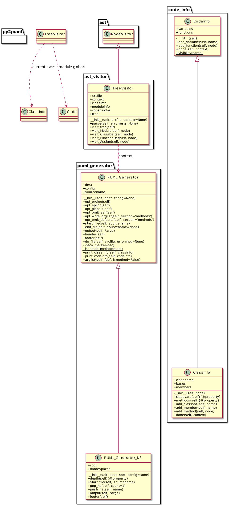

# Python source to PlantUML classes

This program generates PlantUML class diagrams from Python source code.
The source is first parsed by the standard python library
[ast](https://docs.python.org/3/library/ast.htm) which ensures accurate
results as long as the syntax is correct.

## Features
  * optionally use namespaces to represent packages/folders
  * Supports simple and multiple inheritance
  * Include argument lists
  * configurable prolog and epilog, useful for styling
  * allow several input sources for one plantuml output.

## Command line interface

    usage: py2uml [-h] [--config CONFIG] [-o [OUTPUT]] [-r ROOT]
                  py_file [py_file ...]

    py2puml from Martin B. K. Grønholdt, v0.2.1 by Michelle Baert.
    Create PlantUML classes from Python source code.

    positional arguments:
      py_file               the Python source files to parse.

    optional arguments:
      -h, --help            show this help message and exit
      --config CONFIG       Configuration file (replace defaults)
      -o [OUTPUT], --output [OUTPUT]
                            The name of the ouput PlantUML file.
      -r ROOT, --root ROOT  Project root directory. Create namespaces from there

    If no config file is provided, settings are loaded
    sequentially from all available files in :
          - <PROGRAM_DIR>/py2puml.ini
          - <USER_HOME>/.config/py2puml.ini
          - <USER_HOME>/.py2puml.ini
          - <WORK_DIR>/.py2puml.ini
          - <WORK_DIR>/py2puml.ini

## Examples

Several examples are provided. Here is how you build a diagram from this program source code:

    $ cd examples
    $ ../py2puml.py --config custom.ini ../py2puml.py py2puml-custom.puml
    $ java -jar /usr/local/share/plantuml/plantuml.jar py2puml-custom.puml

Hand-made `Makefile`s are there to help automatisation.

**Rendered output**

Of course the diagram can be enriched, with class associations
for example, by editing the generated .puml file, or maybe with an epilog
in custom config.

Here is an example with multiple source files, multiple inheritance, and
[project-specific configuration](examples/cal_clock3/py2puml.ini):

:

## TODO
