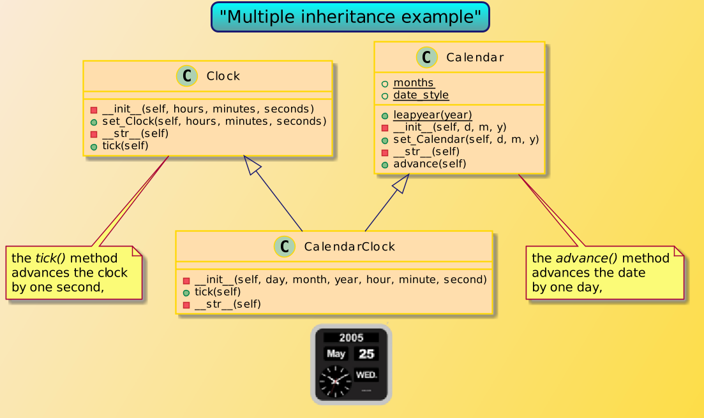

# Python source to PlantUML classes

This program generates PlantUML class diagrams from Python source code.
The source is first parsed by the standard python library
[ast](https://docs.python.org/3/library/ast.htm) which ensures accurate
results as long as the syntax is correct.

## Features
  * optionally use namespaces to represent packages/folders
  * Supports simple and multiple inheritance
  * Optionnally include argument lists
  * Optionnally exclude 'self' and defaults from arg lists
  * configurable prolog and epilog, useful for styling, and class associations
  * allow several input sources for one plantuml output.

## Command line interface

    usage: py2uml [-h] [-c CONFIG] [-o OUTPUT] [-r ROOT] py_file [py_file ...]

    py2puml v1.0.0
    by Michelle Baert, based on work from Martin B. K. Grønholdt.

        Create PlantUML classes from Python source code.

    positional arguments:
      py_file               the Python source files to parse.

    optional arguments:
      -h, --help            show this help message and exit
      -c CONFIG, --config CONFIG
                            Configuration file (replace defaults)
      -o OUTPUT, --output OUTPUT
                            The name of the ouput PlantUML file.
      -r ROOT, --root ROOT  Project root directory. Create namespaces from there

    If no config file is provided, settings are loaded
    sequentially from all available files in :
          - <PROGRAM_DIR>/py2puml.ini
          - <USER_HOME>/.config/py2puml.ini
          - <USER_HOME>/.py2puml.ini
          - <WORK_DIR>/.py2puml.ini
          - <WORK_DIR>/py2puml.ini

    If the provided config filename cannot be found,
    the program will use no config at all.

## Examples

Several examples are provided. Here is how you build a diagram from this program source code:

    $ cd examples
    $ ../py2puml.py --config custom.ini ../py2puml.py py2puml-custom.puml
    $ java -jar /usr/local/share/plantuml/plantuml.jar py2puml-custom.puml

Hand-made `Makefile`s are there to help automatisation.

**Rendered output**

Of course the generated PlantUML script can be edited to fine-tune your diagram,
but a lot of customization can be done by specifying prolog and epilog in a
configuration file.

Here is an example with multiple source files, multiple inheritance, and
[project-specific configuration](examples/cal_clock3/py2puml.ini):

:

## TODO
  - detect and warn about empty results
  - namespace specification of imported names (e.g. inheritance)
